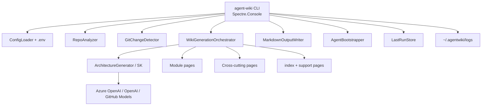

# AgentWiki

**AgentWiki** (`agent-wiki`) is a native **.NET 10** CLI that generates and maintains **agent-optimized documentation wikis** for codebases.

It analyzes a repository, optionally calls an LLM through **Microsoft.SemanticKernel** (OpenAI / Azure OpenAI / GitHub Models), and writes structured Markdown under `docs/wiki/` plus an `AGENTS.md` bootstrap block so coding agents start with durable context.

> **Version:** see `Directory.Build.props` / `agent-wiki --version` (currently 1.0.x).  
> **Handoff for new agents:** **[`docs/HANDOFF.md`](docs/HANDOFF.md)** — read this first in a new conversation.

## Why AgentWiki?

| Problem | AgentWiki approach |
|---------|-------------------|
| Stale internal wikis | `generate` / `update` from live inventory + optional LLM |
| Agents lack repo context | `AGENTS.md` points agents at `docs/wiki/` first |
| JS/Python-only pipelines | Fully native .NET + Semantic Kernel + Azure OpenAI |
| Expensive full rebuilds | Git-based incremental updates with section mapping |

**When to use AgentWiki vs RAG:** AgentWiki produces a **file-based, reviewable wiki** checked into the repo. Use RAG when you need semantic retrieval over large corpora without committing generated docs.

## Quick start

```bash
# Prerequisites: .NET 10 SDK
dotnet build AgentWiki.slnx
dotnet test AgentWiki.slnx

# Install/update the global tool
./scripts/pack-and-install-tool.sh
agent-wiki --version

# Scaffold config in a target repository
agent-wiki init --repo-path /path/to/repo

# Verify LLM credentials (optional)
agent-wiki test-provider --repo-path /path/to/repo

# Full generation (works offline without LLM credentials)
agent-wiki generate --repo-path /path/to/repo --force

# Incremental update (CI-friendly)
agent-wiki update --repo-path /path/to/repo

# Status + live inventory
agent-wiki status --repo-path /path/to/repo --analyze
```

From source without installing the tool:

```bash
dotnet run --project src/AgentWiki.Cli -- generate --repo-path /path/to/repo --force
```

## Architecture



| Project | Role |
|---------|------|
| `src/AgentWiki.Cli` | CLI commands, Semantic Kernel, git, filesystem, DI |
| `src/AgentWiki.Core` | Models, analysis, offline planners, flexible LLM JSON |
| `tests/AgentWiki.Cli.Tests` | xUnit + Shouldly + Moq |

## Commands

| Command | Description |
|---------|-------------|
| `agent-wiki init` | Create `.agentwiki/config.json`, sample prompts, `.env.example` |
| `agent-wiki generate` | Full multi-step wiki generation |
| `agent-wiki update` | Incremental update from git changes since last run |
| `agent-wiki status` | Config, last-run, log path, optional `--analyze` |
| `agent-wiki test-provider` | Verify LLM credentials with a minimal chat call |

### Common options

| Option | Description |
|--------|-------------|
| `-r, --repo-path` | Repository root (default: `.`) |
| `-o, --output` | Wiki output path (default: `docs/wiki`) |
| `-c, --config` | Path to config JSON |
| `-m, --model` | Model / Azure deployment name |
| `--provider` | `azure-openai` \| `openai` \| `github-models` |
| `--force` | Overwrite without confirmation (`generate`) |
| `--dry-run` | Analyze / report without writing files |
| `--verbose` | Stream diagnostics to console (file logging always on) |

## Configuration

**Priority (highest wins):** CLI flags → repo `.env` → `.agentwiki/config.json` → process `AGENTWIKI_*` env → tool `appsettings.json`.

| Source | Best for | Required? |
|--------|----------|-----------|
| `.env` | Secrets and local overrides (wins over config.json) | Optional |
| `config.json` | Provider, model, paths, timeouts, ignore patterns | Recommended |
| Process env | CI secrets / non-interactive runs | Optional |

All LLM settings can be set via environment variables (process env or `.env`):

| Setting | Environment variable |
|---------|----------------------|
| Provider | `AGENTWIKI_Provider` |
| Default model | `AGENTWIKI_DefaultModel` |
| Timeout (seconds) | `AGENTWIKI_LlmTimeoutSeconds` |
| Max summary chars | `AGENTWIKI_MaxLlmSummaryChars` |
| Azure endpoint / deployment / key | `AGENTWIKI_AzureOpenAI__Endpoint`, `__DeploymentName`, `__ApiKey` |
| OpenAI endpoint / model / key | `AGENTWIKI_OpenAI__Endpoint`, `__Model`, `__ApiKey` |

See [`examples/agentwiki.config.json`](examples/agentwiki.config.json) and `.env.example` from `agent-wiki init`.

Useful knobs:

- `llmTimeoutSeconds` (default **300**)
- `maxLlmSummaryChars` (default **16000**)
- `maxFilesToAnalyze`, `enableIncrementalUpdates`, `ignorePatterns`

**Paths:** `--repo-path` and related paths expand `~` to your home directory (e.g. `~/dev/my-repo`). Generated wiki content always uses **repo-relative** paths (never `/Users/…`).

## Logging

| What | Where |
|------|--------|
| Detailed diagnostics | `~/.agentwiki/logs/agent-wiki-YYYYMMDD.log` |
| Terminal UX | Step progress spinner + summary tables (no stack traces by default) |
| Shown on | `status`, generate/update progress, errors |

```bash
ls ~/.agentwiki/logs/
tail -f ~/.agentwiki/logs/agent-wiki-*.log
```

## Wiki output

Default: `docs/wiki/`

```
docs/wiki/
├── index.md
├── architecture.md
├── key-components.md
├── data-flows.md
├── inventory.md
├── glossary.md
├── getting-started.md
├── modules/*.md
├── cross-cutting/*.md
└── .agentwiki-meta.json
```

Generated docs describe the **current** codebase. Prompts instruct the model **not** to invent deprecation/legacy language unless the source has explicit markers (e.g. `[Obsolete]`).

## Incremental updates

`agent-wiki update` diffs against `.agentwiki/last-run.json`, maps changed files to modules/sections, skips work when nothing relevant changed, and rewrites only affected pages (+ support pages).

## Customizing prompts

| Source | Location |
|--------|----------|
| Tool defaults | `src/AgentWiki.Cli/Prompts/*.txt` (embedded) |
| Per-repo overrides | `.agentwiki/prompts/` (from `init`) |

## Versioning & release

```bash
./.grok/skills/bump-version/scripts/bump-version.sh patch   # or minor|major|X.Y.Z
./scripts/pack-and-install-tool.sh
agent-wiki --version
```

Also available as project skill: `/bump-version`.

## Development docs

| Doc | Purpose |
|-----|---------|
| [`docs/HANDOFF.md`](docs/HANDOFF.md) | **New conversation start** — full continuity |
| [`AGENTS.md`](AGENTS.md) | Agent rules for this repo |
| [`CONTRIBUTING.md`](CONTRIBUTING.md) | How to extend |
| [`AgentWiki-Project-Specification.md`](AgentWiki-Project-Specification.md) | Original product spec |
| [`docs/wiki/`](docs/wiki/) | Sample/self wiki (may lag; regenerate after large changes) |

## CI / GitHub Actions

| Workflow | Path | Purpose |
|----------|------|---------|
| **CI** | [`.github/workflows/ci.yml`](.github/workflows/ci.yml) | On push/PR: restore → build → test → pack `AgentWiki.Cli` nupkg → upload artifacts. On `v*` tags: optional NuGet.org publish (`NUGET_API_KEY` secret). |
| **Wiki refresh** | [`.github/workflows/wiki-refresh.yml`](.github/workflows/wiki-refresh.yml) | Dogfoods AgentWiki on *this* repo (offline generate + PR). Weekly schedule + manual dispatch. |
| **Consumer example** | [`examples/github-actions/agent-wiki-update.yml`](examples/github-actions/agent-wiki-update.yml) | **Copy into your app repos** to run `agent-wiki update` and open a docs PR. |

### Consumer repos (use AgentWiki in your pipeline)

1. Copy [`examples/github-actions/agent-wiki-update.yml`](examples/github-actions/agent-wiki-update.yml) to `.github/workflows/agent-wiki-update.yml`.
2. Run `agent-wiki init` once in the repo (commit `.agentwiki/config.json`, not secrets).
3. Optionally set secrets (`OPENAI_API_KEY`, `AZURE_OPENAI_*`, etc.) and vars (`AGENTWIKI_PROVIDER`, …). Without secrets, update still works **offline**.

```bash
# local install of the tool (after a release is on NuGet.org)
dotnet tool install -g AgentWiki.Cli
# or from a local pack:
# ./scripts/pack-and-install-tool.sh
```

### Publishing this tool

```bash
# CI uploads artifacts on every main build.
# To publish to NuGet.org: create a git tag and ensure NUGET_API_KEY is set.
git tag v1.0.10
git push origin v1.0.10
```

## License

[MIT](LICENSE)
