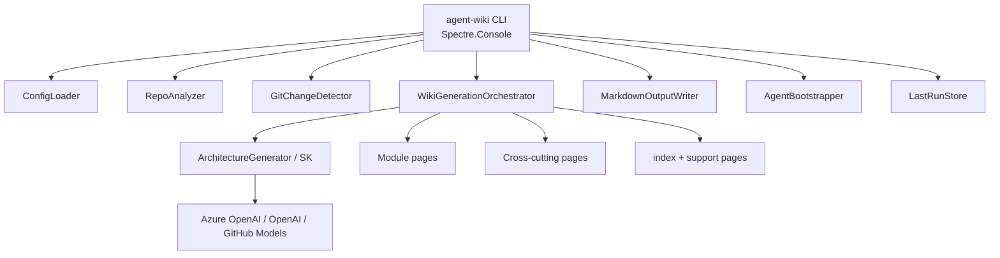

# AgentWiki

**AgentWiki** (`agent-wiki`) is a native **.NET 10** CLI that generates and maintains **agent-optimized documentation wikis** for codebases.

It is a Microsoft/.NET alternative to LangChain’s OpenWiki pattern: analyze a repo, produce structured Markdown under `docs/wiki/`, bootstrap `AGENTS.md`, and keep docs fresh via CI.

> **Status:** v1.0 — Phases 1–6 complete (foundation → analysis → SK generation → multi-step wiki → incremental updates → polish/CI).

## Why AgentWiki?

| Problem | AgentWiki approach |
|---------|-------------------|
| Stale internal wikis | `generate` / `update` from live inventory + optional LLM |
| Agents lack repo context | `AGENTS.md` points agents at `docs/wiki/` first |
| JS/Python-only pipelines | Fully native .NET + Semantic Kernel + Azure OpenAI |
| Expensive full rebuilds | Git-based incremental updates with section mapping |

**When to use AgentWiki vs RAG:** AgentWiki produces a **file-based, reviewable wiki** checked into the repo. Use RAG/vector search when you need semantic retrieval over large, frequently changing corpora without committing generated docs.

## Quick start

```bash
# Prerequisites: .NET 10 SDK
dotnet build AgentWiki.slnx
dotnet test AgentWiki.slnx

# Scaffold config in a target repository
dotnet run --project src/AgentWiki.Cli -- init --repo-path /path/to/repo

# Full generation (works offline without LLM credentials)
dotnet run --project src/AgentWiki.Cli -- generate --repo-path /path/to/repo --force

# Incremental update (CI-friendly)
dotnet run --project src/AgentWiki.Cli -- update --repo-path /path/to/repo

# Status + live inventory
dotnet run --project src/AgentWiki.Cli -- status --repo-path /path/to/repo --analyze
```

### Install as a local `dotnet tool`

```bash
dotnet pack src/AgentWiki.Cli -c Release -o ./artifacts
dotnet tool install --global --add-source ./artifacts AgentWiki.Cli
agent-wiki --version
agent-wiki --help
```

## Architecture



### Solution layout

```
AgentWiki/
├── src/
│   ├── AgentWiki.Cli/          # CLI, services, prompts, SK
│   └── AgentWiki.Core/         # Models + pure helpers
├── tests/
│   └── AgentWiki.Cli.Tests/
├── .github/workflows/
│   └── agent-wiki-update.yml
├── examples/
│   └── agentwiki.config.json
├── docs/wiki/                  # Sample generated output
└── AgentWiki.slnx
```

## Commands

| Command | Description |
|---------|-------------|
| `agent-wiki init` | Create `.agentwiki/config.json`, sample prompts, `.env.example` |
| `agent-wiki generate` | Full multi-step wiki generation |
| `agent-wiki update` | Incremental update from git changes since last run |
| `agent-wiki status` | Config, last-run, optional `--analyze` inventory |
| `agent-wiki test-provider` | Verify LLM credentials with a minimal chat call |

### Common options

| Option | Description |
|--------|-------------|
| `-r, --repo-path` | Repository root (default: `.`) |
| `-o, --output` | Wiki output path (default: `docs/wiki`) |
| `-c, --config` | Path to config JSON |
| `-m, --model` | Model / Azure deployment name |
| `--provider` | `azure-openai` \| `openai` \| `github-models` |
| `--force` | Overwrite without confirmation (`generate`) |
| `--dry-run` | Analyze / report without writing files |
| `--verbose` | Debug logging to console + rolling file log (`-v` is version) |

## Configuration

**Priority (highest wins):**

1. CLI arguments  
2. `.agentwiki/config.json` in the repo  
3. Environment variables (`AGENTWIKI_*`, nested with `__`) — including values loaded from repo-root `.env`  
4. Tool `appsettings.json` defaults  

### config.json vs `.env` — which do I need?

| Source | Best for | Required? |
|--------|----------|-----------|
| `.agentwiki/config.json` | Non-secrets: provider, model, paths, ignore patterns, Azure endpoint/deployment | **Recommended** (created by `init`) |
| `.env` (from `.env.example`) | **Secrets** (API keys) and local overrides | **Optional** — only if you want file-based secrets |
| Process / CI env vars | CI secrets, deployed environments | **Optional** — same keys as `.env` |

You do **not** need both. Typical setups:

- **Local OpenAI:** put `provider` + `openAI.model` in `config.json`; put `AGENTWIKI_OpenAI__ApiKey` in `.env` (or export it).  
- **Local everything in config:** works, but avoid committing API keys.  
- **CI:** inject `AGENTWIKI_*` secrets in the pipeline; `config.json` can stay non-secret.

`agent-wiki` auto-loads `.env` from the **repo root** when present. It never overrides variables already set in the process environment (shell/CI win).

### Verify the LLM provider

```bash
dotnet run --project src/AgentWiki.Cli -- test-provider --repo-path .
# or after tool install:
agent-wiki test-provider --provider openai --model gpt-4o
```

### Example `.agentwiki/config.json`

See also [`examples/agentwiki.config.json`](examples/agentwiki.config.json).

```json
{
  "outputPath": "docs/wiki",
  "defaultModel": "gpt-4o",
  "provider": "openai",
  "agentMdPath": "AGENTS.md",
  "maxFilesToAnalyze": 500,
  "enableIncrementalUpdates": true,
  "azureOpenAI": {
    "endpoint": "https://YOUR_RESOURCE.openai.azure.com/",
    "deploymentName": "gpt-4o",
    "apiKey": "",
    "useManagedIdentity": false
  },
  "openAI": {
    "endpoint": "",
    "apiKey": "",
    "model": "gpt-4o"
  }
}
```

### Environment variables

```bash
# OpenAI
export AGENTWIKI_Provider=openai
export AGENTWIKI_DefaultModel=gpt-4o
export AGENTWIKI_OpenAI__ApiKey=sk-...
export AGENTWIKI_OpenAI__Model=gpt-4o
# Optional custom base URL (compatible gateways):
# export AGENTWIKI_OpenAI__Endpoint=https://...

# Azure OpenAI
export AGENTWIKI_Provider=azure-openai
export AGENTWIKI_AzureOpenAI__Endpoint=https://YOUR_RESOURCE.openai.azure.com/
export AGENTWIKI_AzureOpenAI__DeploymentName=gpt-4o
export AGENTWIKI_AzureOpenAI__ApiKey=...
# Or managed identity:
export AGENTWIKI_AzureOpenAI__UseManagedIdentity=true
```

Without credentials, AgentWiki **still works** using inventory-based offline generation (clearly labeled in the wiki).

## Wiki output

Default: `docs/wiki/`

```
docs/wiki/
├── index.md
├── architecture.md
├── key-components.md
├── data-flows.md
├── inventory.md
├── glossary.md
├── getting-started.md
├── modules/
│   └── *.md
├── cross-cutting/
│   └── *.md
└── .agentwiki-meta.json
```

`agent-wiki generate/update` also maintains an idempotent block in `AGENTS.md` (or existing `CLAUDE.md`).

## Incremental updates

`agent-wiki update`:

1. Loads `.agentwiki/last-run.json` (commit SHA + module list)  
2. Diffs git (commits since baseline + uncommitted changes)  
3. Filters noise (`docs/wiki`, `.agentwiki`, agent md)  
4. Maps changed files → modules / cross-cutting / architecture  
5. Skips work when nothing relevant changed  
6. Selectively regenerates affected sections  
7. Writes last-run + wiki meta on success  

## Customizing prompts

| Source | Location |
|--------|----------|
| Tool defaults | `src/AgentWiki.Cli/Prompts/*.txt` (embedded) |
| Per-repo overrides | `.agentwiki/prompts/` (from `init`) |

Templates use `{{Variable}}` placeholders (`RepoName`, `RepoSummary`, `ModuleName`, …).

## CI/CD

### GitHub Actions

Ready-to-use workflow: [`.github/workflows/agent-wiki-update.yml`](.github/workflows/agent-wiki-update.yml)

- Schedule (daily 02:00 UTC) + push path filters + manual dispatch  
- Runs `agent-wiki update`  
- Opens a PR when `docs/wiki` / `AGENTS.md` change  

**Secrets / vars (optional for live LLM):**

| Name | Purpose |
|------|---------|
| `AZURE_OPENAI_ENDPOINT` | Azure OpenAI endpoint |
| `AZURE_OPENAI_API_KEY` | API key (or use OIDC + managed identity in advanced setups) |
| `AZURE_OPENAI_DEPLOYMENT` | Deployment name |
| `OPENAI_API_KEY` | OpenAI-compatible fallback |

Offline generation still produces useful inventory-backed docs if secrets are unset.

### Azure DevOps (sketch)

```yaml
trigger:
  branches:
    include: [main]
  paths:
    include: [src/*, tests/*]

pool:
  vmImage: ubuntu-latest

steps:
  - task: UseDotNet@2
    inputs:
      version: "10.0.x"
  - script: |
      dotnet build AgentWiki.slnx -c Release
      dotnet run --project src/AgentWiki.Cli -c Release -- update --repo-path . --force
    env:
      AGENTWIKI_AzureOpenAI__Endpoint: $(AZURE_OPENAI_ENDPOINT)
      AGENTWIKI_AzureOpenAI__ApiKey: $(AZURE_OPENAI_API_KEY)
      AGENTWIKI_AzureOpenAI__DeploymentName: $(AZURE_OPENAI_DEPLOYMENT)
  - script: |
      # open PR / publish wiki artifacts as needed for your process
      git status
```

## Reliability & ops

- **Structured outputs:** LLM responses parsed as JSON with fence stripping  
- **Polly retries:** exponential backoff on transient HTTP/LLM failures (not timeouts)  
- **Offline fallback:** pipeline continues without credentials / on LLM failure  
- **Logging:** detailed Serilog diagnostics go to a **file**; the terminal stays clean for Spectre UI  
  - Log directory: `~/.agentwiki/logs/`  
  - Today’s file: `~/.agentwiki/logs/agent-wiki-YYYYMMDD.log`  
  - Shown by `status`, at the start of `generate`/`update`, and on errors  
  - `--verbose` also streams diagnostics to the console (can still interfere with spinners)  
- **Cost estimate:** rough USD from token counts (display only)  
- **Security:** API keys redacted in `status`; do not log full prompts/responses by default  

## Development

```bash
dotnet build AgentWiki.slnx
dotnet test AgentWiki.slnx
dotnet run --project src/AgentWiki.Cli -- --verbose status --analyze
```

See [CONTRIBUTING.md](CONTRIBUTING.md) for extension points (new sections, providers, prompts).

## Implementation roadmap

| Phase | Focus | Status |
|-------|--------|--------|
| 1 | Foundation + CLI skeleton | ✅ |
| 2 | RepoAnalyzer + gitignore | ✅ |
| 3 | Semantic Kernel + architecture | ✅ |
| 4 | Multi-step orchestrator + AGENTS.md | ✅ |
| 5 | Incremental updates | ✅ |
| 6 | Polish, CI, docs, tests | ✅ |

## License

[MIT](LICENSE)
