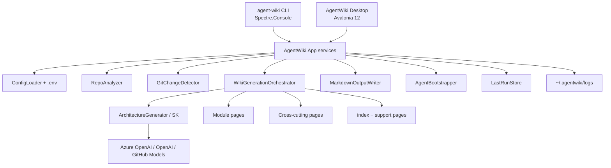

# AgentWiki

**AgentWiki** (`agent-wiki`) is a native **.NET 10** CLI that generates and maintains **agent-optimized documentation wikis** for codebases.

It analyzes a repository, optionally calls an LLM through **Microsoft.SemanticKernel** (OpenAI / Azure OpenAI / GitHub Models), and writes structured Markdown under `docs/wiki/` plus an `AGENTS.md` bootstrap block so coding agents start with durable context.

> **Version:** see `Directory.Build.props` / `agent-wiki --version` (currently **1.3.0**).  
> **Handoff for new agents:** **[`docs/HANDOFF.md`](docs/HANDOFF.md)** — read this first in a new conversation.

## Why AgentWiki?

| Problem | AgentWiki approach |
|---------|-------------------|
| Stale internal wikis | `generate` / `update` from live inventory + optional LLM |
| Agents lack repo context | `AGENTS.md` points agents at `docs/wiki/` first |
| JS/Python-only pipelines | Fully native .NET + Semantic Kernel + Azure OpenAI |
| Expensive full rebuilds | Git-based incremental updates with section mapping |

**When to use AgentWiki vs RAG:** AgentWiki produces a **file-based, reviewable wiki** checked into the repo. Use RAG when you need semantic retrieval over large corpora without committing generated docs.

## Quick start

```bash
# Prerequisites: .NET 10 SDK
dotnet build AgentWiki.slnx
dotnet test AgentWiki.slnx

# Install/update the global tool
./scripts/pack-and-install-tool.sh
agent-wiki --version

# Scaffold config in a target repository
agent-wiki init --repo-path /path/to/repo

# Verify LLM credentials (optional)
agent-wiki test-provider --repo-path /path/to/repo

# Full generation (works offline without LLM credentials)
# Also creates full AGENTS.md when missing/trivial, and README.md when missing/generic
agent-wiki generate --repo-path /path/to/repo --force

# Generate a complete AGENTS.md only (optional --force / --with-readme / --dry-run)
agent-wiki agents --repo-path /path/to/repo

# Incremental update (CI-friendly)
agent-wiki update --repo-path /path/to/repo

# Status + live inventory
agent-wiki status --repo-path /path/to/repo --analyze
```

From source without installing the tool:

```bash
dotnet run --project src/AgentWiki.Cli -- generate --repo-path /path/to/repo --force
```

### Desktop companion (optional)

Same engine as the CLI, for interactive use (repo picker, progress UI, settings editor, wiki browser). **CLI remains primary for CI and automation.** Delivered as a **separate** global tool package (`AgentWiki.Desktop` → `agent-wiki-ui`), not merged into the CLI nupkg. Not published to NuGet.org.

```bash
# Install both tools (or: --cli-only / --desktop-only)
./scripts/pack-and-install-tool.sh
agent-wiki-ui

# From source without installing
./scripts/run-desktop.sh
# or
dotnet run --project src/AgentWiki.Desktop
```

| Tool | Package | Role |
|------|---------|------|
| `agent-wiki` | `AgentWiki.Cli` | CLI for scripts / CI / agents |
| `agent-wiki-ui` | `AgentWiki.Desktop` | Avalonia desktop companion |

| UI surface | CLI equivalent |
|------------|----------------|
| Dashboard | `status` (+ analyze) |
| Generate / Update | `generate` / `update` |
| Setup | `init` |
| Settings | config.json + `.env` layers |
| Provider | `test-provider` |
| Wiki / Logs | browse `docs/wiki` and `~/.agentwiki/logs` |

See [`docs/plans/ui-companion-avalonia.md`](docs/plans/ui-companion-avalonia.md).

## Architecture



| Project | Role |
|---------|------|
| `src/AgentWiki.Core` | Models, analysis, offline planners, flexible LLM JSON |
| `src/AgentWiki.App` | Application services (SK LLM, git, orchestrator, config) shared by hosts |
| `src/AgentWiki.Cli` | Thin Spectre.Console.Cli host + tool packaging |
| `src/AgentWiki.Desktop` | Avalonia 12 desktop companion (MVVM); global tool `agent-wiki-ui` |
| `tests/AgentWiki.Cli.Tests` | Service + offline E2E tests |
| `tests/AgentWiki.Desktop.Tests` | ViewModel / config-editor unit tests |

## Commands

| Command | Description |
|---------|-------------|
| `agent-wiki init` | Create `.agentwiki/config.json`, sample prompts, `.env.example` |
| `agent-wiki generate` | Full multi-step wiki generation; also full AGENTS.md if missing/trivial and README.md if missing/generic |
| `agent-wiki update` | Incremental update from git changes since last run (same AGENTS/README rules when applicable) |
| `agent-wiki agents` | Generate a **complete** `AGENTS.md` from analysis, wiki, and instruction files |
| `agent-wiki status` | Config, last-run, log path, optional `--analyze` |
| `agent-wiki test-provider` | Verify LLM credentials with a minimal chat call |

### `agents` command

```bash
agent-wiki agents --repo-path /path/to/repo
agent-wiki agents --force              # overwrite substantial existing AGENTS.md
agent-wiki agents --dry-run            # preview write/delete (no filesystem changes)
agent-wiki agents --with-readme        # also create/replace missing or generic README.md
```

Generated AGENTS.md always includes a **Keep this file (and README) up to date** section so agents know to maintain both files when workflows change. If `.github/copilot-instructions.md` exists, its content is migrated into AGENTS.md and the source file is removed after a successful write (not on dry-run).

### `generate` agent docs behavior (defaults on)

| Config flag | Default | Behavior |
|-------------|---------|----------|
| `generateAgentsMdIfMissing` | `true` | Write a **full** AGENTS.md when missing or trivial; refresh only the AgentWiki block when a substantial file already exists |
| `generateReadmeIfMissingOrGeneric` | `true` | Write README.md when missing or detected as a generic template; never overwrite a real README |
| `migrateCopilotInstructions` | `true` | Merge well-known Copilot instruction files into AGENTS.md and delete them after success |

### Common options

| Option | Description |
|--------|-------------|
| `-r, --repo-path` | Repository root (default: `.`) |
| `-o, --output` | Wiki output path (default: `docs/wiki`); for `agents`, optional AGENTS.md path |
| `-c, --config` | Path to config JSON |
| `-m, --model` | Model / Azure deployment name |
| `--provider` | `azure-openai` \| `openai` \| `github-models` |
| `--force` | Overwrite without confirmation (`generate` wiki; `agents` overwrites substantial AGENTS.md) |
| `--dry-run` | Analyze / report without writing files |
| `--verbose` | Stream diagnostics to console (file logging always on) |

## Configuration

**Priority (highest wins):** CLI flags → repo `.env` → `.agentwiki/config.json` → process `AGENTWIKI_*` env → tool `appsettings.json`.

| Source | Best for | Required? |
|--------|----------|-----------|
| `.env` | Secrets and local overrides (wins over config.json) | Optional |
| `config.json` | Provider, model, paths, timeouts, ignore patterns | Recommended |
| Process env | CI secrets / non-interactive runs | Optional |

All LLM settings can be set via environment variables (process env or `.env`):

| Setting | Environment variable |
|---------|----------------------|
| Provider | `AGENTWIKI_Provider` |
| Default model | `AGENTWIKI_DefaultModel` |
| Timeout (seconds) | `AGENTWIKI_LlmTimeoutSeconds` |
| Max summary chars | `AGENTWIKI_MaxLlmSummaryChars` |
| Post-processing on/off | `AGENTWIKI_EnablePostProcessing` |
| Post-processing mode | `AGENTWIKI_PostProcessingMode` (`lenient` \| `strict`) |
| Roslyn analysis on/off | `AGENTWIKI_EnableRoslynAnalysis` |
| Roslyn caps | `AGENTWIKI_MaxProjectsToAnalyze`, `AGENTWIKI_MaxSourceFilesForRoslyn` |
| App Insights | `AGENTWIKI_ApplicationInsightsConnectionString` |
| Cost rates (USD/1M) | `AGENTWIKI_InputUsdPerMillionTokens`, `AGENTWIKI_OutputUsdPerMillionTokens` |
| Azure endpoint / deployment / key | `AGENTWIKI_AzureOpenAI__Endpoint`, `__DeploymentName`, `__ApiKey` |
| OpenAI endpoint / model / key | `AGENTWIKI_OpenAI__Endpoint`, `__Model`, `__ApiKey` |
| OpenAI key (shorthand / industry) | `AGENTWIKI_ApiKey` or `OPENAI_API_KEY` (fill-if-empty) |

See [`examples/agentwiki.config.json`](examples/agentwiki.config.json) and `.env.example` from `agent-wiki init`.

Useful knobs:

- `llmTimeoutSeconds` (default **300**)
- `maxLlmSummaryChars` (default **16000**)
- `enablePostProcessing` (default **true**) — guardrails after LLM/offline generation
- `postProcessingMode` — `lenient` (default) or `strict` (drops unverified deprecation claims more aggressively)
- `enableRoslynAnalysis` (default **true**) — optional C# syntax analysis for richer offline wikis
- `maxProjectsToAnalyze` / `maxSourceFilesForRoslyn` — Roslyn performance caps
- `enableApiEndpointDocs` (default **true**) — emit `api-endpoints.md` + per-module endpoint sections
- `enableEndpointLlmEnrichment` — optional short LLM descriptions when credentials exist
- `endpointIncludePatterns` / `endpointExcludePatterns` — filter routes/paths
- `maxModules` (default **16**) / `maxFilesPerModule` (default **40**)
- `moduleRoots` / `moduleGlobs` — pin or discover module roots (e.g. `src/*/`)
- `includeTestProjectsAsModules` (default **false**) — keep tests out of the primary module set unless needed
- `applicationInsightsConnectionString` — optional run telemetry (off when empty)
- `inputUsdPerMillionTokens` / `outputUsdPerMillionTokens` — override cost estimate rates
- `maxFilesToAnalyze`, `enableIncrementalUpdates`, `ignorePatterns`

**Paths:** `--repo-path` and related paths expand `~` to your home directory (e.g. `~/dev/my-repo`). Generated wiki content always uses **repo-relative** paths (never `/Users/…`). A post-processor also rewrites accidental absolute paths in LLM output.

## Logging

| What | Where |
|------|--------|
| Detailed diagnostics | `~/.agentwiki/logs/agent-wiki-YYYYMMDD.log` |
| Terminal UX | Step progress spinner + summary tables (no stack traces by default) |
| Shown on | `status`, generate/update progress, errors |

```bash
ls ~/.agentwiki/logs/
tail -f ~/.agentwiki/logs/agent-wiki-*.log
```

## Wiki output

Default: `docs/wiki/`

```
docs/wiki/
├── index.md
├── architecture.md
├── api-endpoints.md
├── key-components.md
├── data-flows.md
├── inventory.md
├── glossary.md
├── getting-started.md
├── modules/*.md
├── cross-cutting/*.md
└── .agentwiki-meta.json
```

Generated docs describe the **current** codebase. Prompts instruct the model **not** to invent deprecation/legacy language unless the source has explicit markers (e.g. `[Obsolete]`).

## Incremental updates

`agent-wiki update` diffs against `.agentwiki/last-run.json`, maps changed files to modules/sections, skips work when nothing relevant changed, and rewrites only affected pages (+ support pages).

## Customizing prompts

| Source | Location |
|--------|----------|
| Tool defaults | `src/AgentWiki.App/Prompts/*.txt` (embedded) |
| Per-repo overrides | `.agentwiki/prompts/` (from `init`) |

## Versioning & release

```bash
./.grok/skills/bump-version/scripts/bump-version.sh patch   # or minor|major|X.Y.Z
./scripts/pack-and-install-tool.sh          # packs + installs agent-wiki and agent-wiki-ui
agent-wiki --version
# agent-wiki-ui   # launches Desktop
```

Also available as project skill: `/bump-version`.

## Development docs

| Doc | Purpose |
|-----|---------|
| [`docs/HANDOFF.md`](docs/HANDOFF.md) | **New conversation start** — full continuity |
| [`AGENTS.md`](AGENTS.md) | Agent rules for this repo |
| [`CONTRIBUTING.md`](CONTRIBUTING.md) | How to extend |
| [`AgentWiki-Project-Specification.md`](AgentWiki-Project-Specification.md) | Original product spec |
| [`docs/wiki/`](docs/wiki/) | Sample/self wiki (may lag; regenerate after large changes) |

## CI / automation

| Workflow | Path | Purpose |
|----------|------|---------|
| **CI** | [`.github/workflows/ci.yml`](.github/workflows/ci.yml) | On push/PR: restore → build → test → pack CLI + Desktop nupkgs → upload as **workflow artifacts** (not published to NuGet.org). |
| **Wiki refresh** | [`.github/workflows/wiki-refresh.yml`](.github/workflows/wiki-refresh.yml) | Dogfoods AgentWiki on *this* repo (offline generate + PR). Weekly schedule + manual dispatch. |
| **Consumer (GitHub)** | [`examples/github-actions/agent-wiki-update.yml`](examples/github-actions/agent-wiki-update.yml) | **Copy into your app repos** to run `agent-wiki update` and open a docs PR. |
| **Consumer (Azure DevOps)** | [`examples/azure-pipelines/agent-wiki-update.yml`](examples/azure-pipelines/agent-wiki-update.yml) | **Copy-paste Azure Pipelines** sample with schedule, secrets, dry-run, and optional PR. |

### Consumer repos (use AgentWiki in your pipeline)

**GitHub Actions**

1. Copy [`examples/github-actions/agent-wiki-update.yml`](examples/github-actions/agent-wiki-update.yml) to `.github/workflows/agent-wiki-update.yml`.
2. Run `agent-wiki init` once in the repo (commit `.agentwiki/config.json`, not secrets).
3. Optionally set secrets (`OPENAI_API_KEY`, `AZURE_OPENAI_*`, etc.) and vars (`AGENTWIKI_PROVIDER`, …). Without secrets, update still works **offline**.
4. Point the install step at your feed when you start publishing the tool (local pack, Azure Artifacts, etc.).

**Azure DevOps**

1. Copy [`examples/azure-pipelines/agent-wiki-update.yml`](examples/azure-pipelines/agent-wiki-update.yml) into your repo and create a pipeline from it.
2. Link a variable group (or pipeline variables) for optional secrets: `OPENAI_API_KEY`, `AZURE_OPENAI_*`, `AGENTWIKI_PROVIDER`, …
3. Enable **Allow scripts to access the OAuth token** if you want the sample to open a PR via REST.
4. Without LLM secrets the pipeline still runs **offline** generation/update.
5. Use pipeline parameters for full `generate --force` or `--dry-run`.

```bash
# Local install from a pack produced by CI or scripts/pack-and-install-tool.sh
./scripts/pack-and-install-tool.sh
agent-wiki --version
agent-wiki-ui   # Desktop companion (Settings → Appearance for dark/light/system theme)
```

### Packaging this tool (no public NuGet yet)

CI always **packs** and uploads the `.nupkg` as a GitHub Actions artifact so you can download it from a run. Publishing to Azure Artifacts (or NuGet.org) can be added later when you are ready; it is intentionally not wired up now.

### Desktop theme

`agent-wiki-ui` follows the **system** theme by default. Override in **Settings → Appearance** (`system` | `dark` | `light`). Preference is stored in `~/.agentwiki/ui-settings.json` (not in the target repo).

## License

[MIT](LICENSE)
