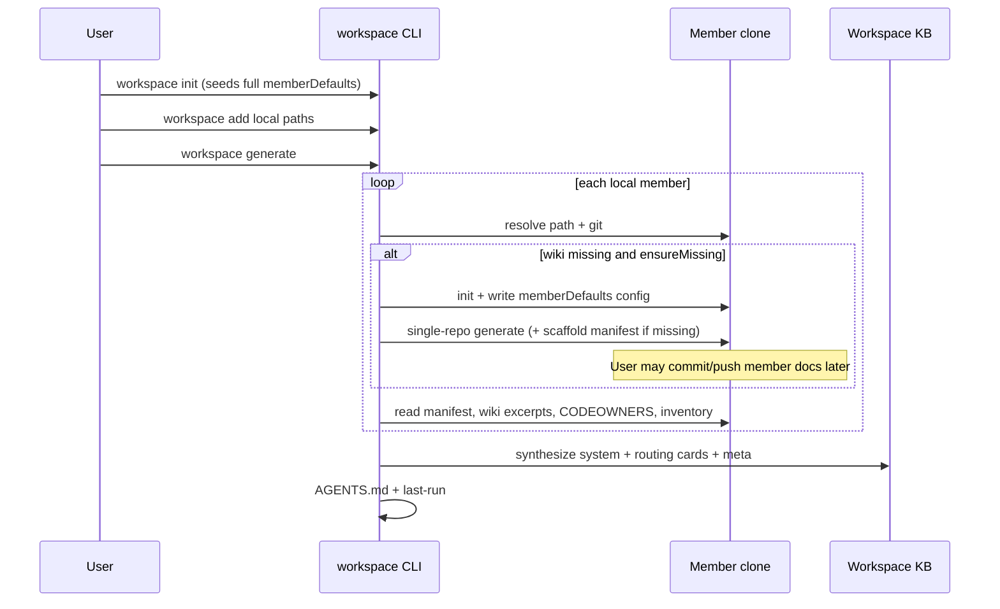

# Step 02b — Workspace Corpus, Routing Quality & Member Orchestration

**Project:** AgentWiki  
**Version target:** 1.5.0 (or next minor after current 1.4.x)  
**Date:** 2026-07-21  
**Status:** Ready for implementation  
**Depends on:** Step 02 Phase 1 file-based workspace (v1.4.x)  
**Enables:** [GitHub issue #2](https://github.com/MarshallMoorman/AgentWiki/issues/2) — Vector / Azure AI Search (Phase 2)  
**Audience:** Implementing agents **and** human reviewers (architecture, product, consulting partners)

---

## 1. Executive summary

Step 02 delivered a **file-based multi-repo workspace** (`workspace init|add|list|remove|status|generate|update`). Early use showed that the thin system KB plus path-only “deep links” into member wikis does not deliver multi-user value and is a weak foundation for Phase 2 vectors.

**Step 02b reframes workspace mode** as:

1. **Orchestrator** of single-repo documentation for **local full clones**
2. **Synthesizer** of a durable, source-controlled **global knowledge base** in the workspace repo
3. **Routing corpus** optimized so agents (and later MCP + Azure AI Search) can answer: *“Which repo(s)—and at which layer—should this story touch?”* including **brand** and **application/service** context when requirements are brand-specific

Member repos remain the home of **deep** wikis and human-owned **manifest** fields. The workspace **ingests** those signals, **does not** blindly mirror every member page, and **publishes** a self-contained KB under `docs/knowledge-base/` with **web deep links** (GitHub / Azure DevOps) to member detail when remotes are known.

**This step is still file-based only.** No embeddings, Azure AI Search client, or MCP server implementation. Those are Phase 2; this step must produce a corpus and metadata contract Phase 2 can index without redesign.

**Quality bar:** After **each** implementation phase: green build, green full test suite, **high-confidence automated coverage** for new behavior, docs (`AGENTS.md`, `README.md`, `docs/HANDOFF.md`) updated as needed, version bump + pack/install when user-facing, then a **clean commit**. **Single-repo mode must not regress.**

---

## 2. Context & problem statement

### 2.1 What exists (v1.4.x)

| Capability | State |
|------------|--------|
| `workspace.json`, local/remote members | Done |
| System pages (index, architecture, dependency-graph, …) | Offline thin scaffold |
| Member wiki ensure | Can run single-repo generate into path or cache |
| Deep links | Path strings like `` `docs/wiki/index.md` `` |
| Staleness | Calendar age (e.g. 14 days) |
| Member id | Kebab-case derivation from path/remote |
| LLM synthesis for workspace system pages | Effectively offline-only |
| Config bootstrap for members | Manual per repo |

### 2.2 Problems

1. **Links** — Local relative paths are not valid on GitHub-hosted workspace KB; remote cache generates do not publish member docs.
2. **Corpus** — Workspace pages are too thin for estate-scale **repo routing**.
3. **Phase 2** — Indexing needs a **guaranteed, durable Markdown corpus** with stable ids and metadata; optional sibling checkouts/cache are not enough.
4. **Human authority** — Layer, routing guidance, team, **applications/services**, and **brands** must be **human-manageable in the member repo**, not only inferred.
5. **Ops** — Users need clear control over when member wikis are generated/updated; CI should be first-class; no surprise bulk regenerations by default. Bootstrapping **identical** single-repo config across many members is painful without workspace-level defaults and a force-replace tool.

### 2.3 Product vision (locked)

```text
Member repos (local full clones preferred)
  ├── Human manifest (Markdown)     ← authority for layer, routing, team, apps, brands
  ├── Single-repo wiki + AGENTS.md  ← deep docs for in-repo agents
  ├── .agentwiki/config.json        ← may be bootstrapped from workspace memberDefaults
  └── CODEOWNERS / inventory        ← ownership + signals
           │
           ▼  workspace generate (orchestrate + synthesize)
Workspace repo
  ├── .agentwiki/workspace.json     ← members + full memberDefaults section
  └── docs/knowledge-base/**        ← global view (git-reviewable, GitHub-browsable)
           │
           ▼  Phase 2 (out of scope for 02b)
Azure AI Search index  →  shared HTTP MCP  →  IDE / product agents
```

| Consumer | Primary surface |
|----------|-----------------|
| Dev agent **in a repo** | That repo’s `docs/wiki/`, `AGENTS.md`, manifest, config |
| Global / story-routing agent | Workspace KB (+ later MCP over vectors) |
| Product / multi-repo discovery | Workspace KB (+ later MCP) |
| Human browsing workspace on GitHub | Workspace MD + **web links** into member repos |

---

## 3. Goals

1. **Durable workspace corpus** under `outputPath` (default `docs/knowledge-base/`) that is self-contained for routing and system orientation.
2. **Ingest + synthesize** (LLM when configured; offline fallback) — not full copy of every member wiki page.
3. **Member contribution manifest** (Markdown in each member repo) holding **all human-managed fields** required for routing/workspace quality, including **purpose, maintenance rules, applications/services, and brands** documented **in the file itself**.
4. **Single-repo generate** discovers/emits inferred defaults (e.g. layer candidates) that humans can promote into the manifest.
5. **Member orchestration** for **local full clones only**: init with full `memberDefaults`, generate missing wikis, optional update when **git-stale**.
6. **`memberDefaults`** in `workspace.json` is a **complete** single-repo config template (all keys a member `config.json` would have), unused by workspace runtime except for **copy / replace** into members.
7. **`workspace member replace-configs`** force-overwrites every (or selected) local member’s `config.json` from `memberDefaults` (standalone command, similar spirit to `agents`).
8. **Web deep links** to member wikis using tracked upstream remote (else `origin`), current working branch, GitHub **and** Azure DevOps URL patterns.
9. **Stable member ids** = exact git/repo name (collision suffix only when needed).
10. **Staleness** = missing wiki **or** repo git changes since last successful member wiki generation — **not** calendar age alone.
11. **Phase 2 / MCP readiness**: stable paths, ids, layer, team, brands, applications, repo web URLs in corpus; design notes only (no vector/MCP code).
12. **CI-friendly** non-interactive flags; interactive prompts optional and secondary.
13. **No auto-push**; commit/push remains user/CI policy.
14. Preserve offline usability of the file-based KB when LLM/index is unavailable.
15. **Do not break single-repo mode**; expand tests so confidence remains high for both modes.
16. **After each implementation phase:** build + full tests green, high coverage for new code, update AGENTS/README/HANDOFF as needed, version + pack when shipping user-visible increments, **commit**.

---

## 4. Non-goals

- Vector embeddings, Azure AI Search, RAG query implementation, MCP server (Phase 2 / issue #2).
- Auto `git push` / open PRs for member or workspace repos.
- Generating member wikis into remote **cache** and treating that as published documentation.
- Full mirror of every member `docs/wiki/**` file into the workspace by default.
- Desktop UI for workspace corpus (CLI-first; Desktop later).
- Replacing single-repo mode for day-to-day development.
- Per-team separate search indexes (one estate index later).
- Real-time watchers / auto-discovery of all org repos.
- Using `memberDefaults` as the live config for workspace LLM calls (workspace may load its own config/env; `memberDefaults` is a **template for members**).

---

## 5. Definitions

| Term | Meaning |
|------|---------|
| **Workspace root** | Directory holding `.agentwiki/workspace.json` and usually the global KB |
| **Member** | Entry in `workspace.json` with `id` + local `path` and/or `remote` |
| **Local full clone** | Member `path` pointing at a complete git working tree the user can commit from |
| **Member wiki** | That member’s single-repo AgentWiki output (default `docs/wiki/`) |
| **Manifest** | Human-owned Markdown in the member repo with authoritative routing/layer/team/apps/brands fields |
| **Workspace corpus / KB** | Generated Markdown under workspace `outputPath` |
| **Routing card** | Synthesized per-member pages optimized for “should work land here?” |
| **Git-stale** | Member source changed since last recorded successful member wiki generate for that member |
| **memberDefaults** | Full single-repo config template section inside `workspace.json`; copied/replaced into members; **not** the workspace runtime config itself |
| **replace-configs** | CLI that force-writes `memberDefaults` → each selected member’s `.agentwiki/config.json` |

---

## 6. Architecture constraints (implementers must follow)

1. **Clean layering:** Core (models, parsers, link builders, offline synthesizers) → App (orchestration services) → thin CLI.
2. Register via `AddAgentWikiServices()`.
3. **Reuse** single-repo `IWikiGenerator`, `IInitService`, `IConfigLoader`, `RepoAnalyzer`, last-run stores — do not fork pipelines.
4. Primary constructors, nullable, file-scoped namespaces, constants in `Constants.*`.
5. Never log secrets / full LLM bodies by default.
6. Offline path must produce usable (if thinner) corpus when LLM unavailable.
7. **Do not break existing single-repo commands or public contracts.**
8. Dry-run never writes (member or workspace).
9. Prefer small, reviewable commits **per phase** (§16).
10. **Test coverage:** new features require thorough unit + integration tests such that regressions in workspace **or** single-repo mode are unlikely. Prefer high coverage on parsers, policies, link builders, config copy/replace, orchestration branching. Run **full** `dotnet test AgentWiki.slnx` after every phase—not only filtered tests.

---

## 7. Functional requirements

### 7.1 Member identity

**FR-ID-1.** Default member `id` when adding without explicit id MUST be the **exact repository name**:
- Local path: last path segment of the resolved directory (e.g. `Elevate-LMS-LoanView`).
- Remote URL: last path segment with optional `.git` stripped.

**FR-ID-2.** Do **not** kebab-case or lowercase the id as the primary form. Extend validation to allow real repo names (letters, digits, `.`, `-`, `_`). Document remaining forbidden characters.

**FR-ID-3.** On collision, append `-2`, `-3`, … Log clearly.

**FR-ID-4.** Explicit `--id` / two-arg form still overrides derivation.

---

### 7.2 Workspace configuration extensions

**FR-CFG-1.** Extend `workspace.json` (camelCase JSON). Illustrative shape:

```json
{
  "name": "Elevate LMS",
  "description": "Cross-repo knowledge base for LMS services",
  "outputPath": "docs/knowledge-base",
  "agentMdPath": "AGENTS.md",
  "generateAgentsMd": true,
  "memberWikiPolicy": {
    "ensureMissing": true,
    "updateMembers": "never"
  },
  "memberDefaults": {
    "repoPath": ".",
    "outputPath": "docs/wiki",
    "defaultModel": "gpt-4o",
    "provider": "azure-openai",
    "agentMdPath": "AGENTS.md",
    "generateAgentsMdIfMissing": true,
    "generateReadmeIfMissingOrGeneric": true,
    "migrateCopilotInstructions": true,
    "readmeGenericMaxLength": 500,
    "agentsMdTrivialMaxLength": 200,
    "maxFilesToAnalyze": 500,
    "enableIncrementalUpdates": true,
    "llmTimeoutSeconds": 1200,
    "maxLlmSummaryChars": 32000,
    "allowOfflineFallback": true,
    "enablePostProcessing": true,
    "postProcessingMode": "lenient",
    "enableRoslynAnalysis": true,
    "maxProjectsToAnalyze": 20,
    "maxSourceFilesForRoslyn": 500,
    "enableApiEndpointDocs": true,
    "enableEndpointLlmEnrichment": true,
    "endpointIncludePatterns": [],
    "endpointExcludePatterns": [],
    "maxModules": 16,
    "maxFilesPerModule": 40,
    "moduleRoots": [],
    "moduleGlobs": [],
    "includeTestProjectsAsModules": false,
    "applicationInsightsConnectionString": null,
    "inputUsdPerMillionTokens": null,
    "outputUsdPerMillionTokens": null,
    "modelPricing": {},
    "ignorePatterns": [
      "**/bin/**",
      "**/obj/**",
      "**/node_modules/**",
      "**/.git/**",
      "**/packages/**",
      "**/*.min.js",
      "**/*.min.css",
      "**/docs/wiki/**",
      "**/.agentwiki/**"
    ],
    "azureOpenAI": {
      "endpoint": null,
      "deploymentName": null,
      "apiKey": null,
      "useManagedIdentity": false
    },
    "openAI": {
      "endpoint": null,
      "apiKey": null,
      "model": null
    }
  },
  "members": [
    {
      "id": "Elevate-LMS-LoanView",
      "path": "../lms/Elevate-LMS-LoanView",
      "label": "Loan View",
      "role": "service",
      "wikiPath": "docs/wiki"
    }
  ]
}
```

**FR-CFG-2. `memberDefaults` (complete member config template)**

1. **Purpose:** Bootstrap and maintain **identical** single-repo settings across many members without editing each repo by hand. Lives **in `workspace.json`** (not a separate file) so editors see defaults next to members.
2. **Shape:** MUST be able to represent **every property** that a member `.agentwiki/config.json` can hold—the same surface as `AgentWikiConfig` (including nested `azureOpenAI` / `openAI`, lists, pricing maps, ignore patterns, etc.).
3. **Runtime:** Workspace generate/update **does not** treat `memberDefaults` as the workspace’s own LLM/config for system synthesis unless separately designed; primary use is **copy/replace into members**. Workspace LLM settings continue via env / tool config / optional future workspace-level keys **outside** this template if needed.
4. **Secrets:** Prefer env vars over committing keys in `memberDefaults`. If apiKey-like fields are non-empty in JSON, **warn** on load (do not print values). Document that committed secrets are forbidden.
5. **Scaffold:** `workspace init` SHOULD seed a full `memberDefaults` object with the same defaults as single-repo `init` would write to `config.json` (so the section is complete and obvious).
6. **Serialization:** Round-trip must not drop unknown future properties when possible (prefer flexible DTO aligned with `AgentWikiConfig`).

**FR-CFG-3. `memberWikiPolicy`**

| Field | Meaning | Default |
|-------|---------|---------|
| `ensureMissing` | Auto init+generate when local member wiki missing | `true` |
| `updateMembers` | `never` \| `stale` \| `all` | `never` |

CLI flags override config for one run (§7.9).

**FR-CFG-4.** Legacy `ensureMemberWikis`: map carefully; document precedence: **CLI > `memberWikiPolicy` > legacy flag**.

---

### 7.3 Member contribution manifest (human-owned)

All fields that must be **provided and managed by humans in the member repo** live in **one Markdown manifest**. It is renderable on GitHub/ADO as normal documentation.

#### 7.3.1 Location

**FR-MAN-1.** Canonical path (constant):

```text
docs/wiki/workspace-manifest.md
```

If `wikiPath` is customized: `{wikiPath}/workspace-manifest.md`.

**FR-MAN-2.** On single-repo `generate` / first ensure:
- If missing, **scaffold** the full template (do not overwrite existing).
- Template **is the documentation**: purpose, maintenance rules, and field definitions appear **in the file itself** (not only in AgentWiki product docs).
- Reference the file from member wiki index / AGENTS when generating.

#### 7.3.2 Document self-description (required in every scaffold)

**FR-MAN-3.** The scaffold MUST begin with a human-readable **Purpose** and **Maintenance rules** section **before** data sections, for example:

```markdown
# Workspace contribution manifest

## Purpose

This file is the **human-owned** contract between this repository and any AgentWiki
**workspace** that includes it. Workspace generate **ingests** this file to build
routing cards and the estate knowledge base used by multi-repo agents (and later
search / MCP). It is **not** regenerated by AgentWiki except for initial scaffold
when missing.

Deep implementation detail still lives in `docs/wiki/` (architecture, modules, APIs).
This manifest answers: **what this repo is for, which apps it owns, which brands it
supports, which layer it sits on, who owns it, and when work should (or should not)
be routed here.**

## Maintenance rules

1. **Humans edit this file** in the same PRs that change ownership, layering, brands,
   applications, or routing intent. Agents may propose edits; humans approve.
2. **Do not delete required section headings** — tooling parses by heading text.
3. Prefer **short bullets** under routing sections; put long narrative under
   Additional context.
4. Keep **Layer** and **Brands** accurate — incorrect values cause mis-routing across
   similarly named APIs.
5. List every **Application/Service** this repo truly owns or ships; omit unrelated
   systems that only call this repo.
6. After material changes, re-run member `agent-wiki generate` / `update` if needed,
   then workspace `generate` so the estate KB refreshes.
7. Do not put secrets, connection strings, or credentials in this file.

---
```

Heading text for parsers remains stable for data sections below.

#### 7.3.3 Required data sections (human-managed)

**FR-MAN-4.** Exact heading text (recommended case-sensitive match):

```markdown
## Layer

experience | process | domain | ui | data | shared | infrastructure | other

## Team

@team-or-name

## Applications / Services

- ApplicationOrServiceName — short description of what it does
- …

## Brands

Rise, Shine, Elastic, Blueprint

(Comma-separated and/or bullets. Use only applicable brands. Blueprint = dummy/non-prod brand used for templates and demos.)

## Responsibilities

- …

## Route work here when

- …

## Do not route work here when

- …

## Related systems

- …

## Keywords

payment, loan-view, …

## Additional context

Free-form Markdown always ingested into the workspace routing card.
```

**FR-MAN-5. Applications / Services**  
- One or many entries per repo.  
- Each item: stable name + optional description.  
- Workspace routing card and Phase 2 meta SHOULD surface this list so agents can match story text to a concrete app/service inside a multi-app repo.

**FR-MAN-6. Brands**  
- Controlled vocabulary (document in scaffold): **Rise**, **Shine**, **Elastic**, **Blueprint**.  
- Repos may support a subset.  
- **Blueprint** is the dummy/template brand.  
- Critical for brand-specific requirements (“Rise-only payment UX”).  
- Parser: accept comma-separated and/or bullet lists; normalize case for known brands; preserve unknown tokens with a warning.

**FR-MAN-7.** Parser: tolerant whitespace; missing file ⇒ warnings + weaker inference; empty Layer/Brands/Apps ⇒ warnings.

**FR-MAN-8. Authority order**

1. Manifest (human)  
2. Inferred single-repo hints (non-authoritative, labeled)  
3. CODEOWNERS / inventory heuristics  

Never overwrite an existing manifest except user-driven edits. Scaffold only when missing.

#### 7.3.4 Complete human-managed field list

| Field | Section | Notes |
|-------|---------|--------|
| Purpose & rules | `## Purpose`, `## Maintenance rules` | Documentation for maintainers (in-file) |
| Layer | `## Layer` | UI / experience / process / domain / … |
| Team | `## Team` | Display priority over CODEOWNERS when set |
| Applications / Services | `## Applications / Services` | One or many |
| Brands | `## Brands` | Rise, Shine, Elastic, Blueprint subset |
| Responsibilities | `## Responsibilities` | |
| Positive routing | `## Route work here when` | |
| Negative routing | `## Do not route work here when` | |
| Related systems | `## Related systems` | |
| Keywords | `## Keywords` | |
| Additional context | `## Additional context` | Free-form |

---

### 7.4 Single-repo generate enhancements

**FR-SR-1.** Infer layer / short responsibility hints from inventory; emit non-authoritative suggestions (architecture section and/or `workspaceHints` in meta).  
**FR-SR-2.** Never overwrite `workspace-manifest.md`.  
**FR-SR-3.** Scaffold full manifest template (with Purpose, rules, apps, brands) when missing.  
**FR-SR-4.** Workspace-orchestrated member generate uses the **same** `IWikiGenerator` / init path as single-repo CLI.

---

### 7.5 Member init + applying `memberDefaults`

**FR-INIT-1.** When workspace needs to init a local member (missing `.agentwiki/config.json` and policy requires generate):
1. Equivalent of `agent-wiki init` for that path (respect existing non-force behavior).  
2. Write **`memberDefaults`** as the member’s `config.json` content (full template), adjusting only paths that must be member-local if required (`repoPath` → `.`).  
3. Do **not** re-apply defaults on later generates (unless `replace-configs`).

**FR-INIT-2.** CLI: `agent-wiki workspace member init <id>` — init + defaults without full wiki generate.

**FR-INIT-3.** Log: applied memberDefaults (init).

---

### 7.6 Force replace member configs (`replace-configs`)

Standalone feature (same product spirit as `agent-wiki agents`: focused, explicit, high-value).

**FR-RC-1.** New command:

```bash
agent-wiki workspace member replace-configs
agent-wiki workspace member replace-configs --dry-run
agent-wiki workspace member replace-configs --id Elevate-LMS-LoanView
agent-wiki workspace member replace-configs --force   # skip confirmations if any
```

**FR-RC-2.** Behavior:
- Load `memberDefaults` from workspace.json (error if missing/empty).  
- For each selected **local full clone** member (default: **all** local path members):  
  - Write `.agentwiki/config.json` as a **full replacement** from `memberDefaults` (even if config already exists).  
  - Create `.agentwiki/` if needed.  
- Skip remote-only members with a clear warning.  
- **Dry-run:** report would-create / would-overwrite paths; no writes.  
- Do not run generate. Do not push.

**FR-RC-3.** Safety:
- Spectre confirmation when overwriting multiple existing configs unless `--force` or non-interactive CI env documented.  
- Never print secret values; may say “apiKey is set in defaults”.

**FR-RC-4.** Tests: dry-run no write; force replace content matches defaults; remote-only skipped; single-repo config loader still reads resulting JSON.

---

### 7.7 Member wiki orchestration (local full clones only)

**FR-ORCH-1.** Write ops only when local `path` is a real git working tree, not cache (unless `--allow-cache-write`, default off).

**FR-ORCH-2. Missing wiki** (`ensureMissing: true`): auto init (defaults) + generate during `workspace generate`. Non-interactive.

**FR-ORCH-3. Stale**

```text
MISSING  = no wiki index at member wiki path
STALE    = wiki exists AND git changed since last successful member wiki baseline
NOT STALE = wiki exists AND no such changes (even if files are old)
```

Baseline: member `last-run.json` commitSha → else workspace per-member head after member generate → else conservative STALE once.

**FR-ORCH-4.** Calendar age alone does **not** mark STALE (optional soft warning only).

**FR-ORCH-5. Update policy**

| Policy / CLI | Behavior |
|--------------|----------|
| `never` (default) | Only MISSING (if ensureMissing) |
| `stale` | MISSING + STALE |
| `all` | Force all local members |

**FR-ORCH-6.** CLI includes `workspace member status|init|generate|update|replace-configs`.

**FR-ORCH-7.** Remote-only: analyze only; warn on write policies; synthesis continues with available signals.

**FR-ORCH-8.** Never git commit/push.

---

### 7.8 Web deep links (GitHub + Azure DevOps)

**FR-LINK-1.** Remote: tracked upstream for current branch → else `origin` → else first remote.  
**Branch:** current working branch (`rev-parse --abbrev-ref HEAD`).  
**FR-LINK-2.** Build GitHub and Azure DevOps (Microsoft-hosted) blob/browse URLs.  
**FR-LINK-3.** Prefer web URLs on routing cards and index.  
**FR-LINK-4.** Fallback to path + warning if no remote.

---

### 7.9 Workspace corpus layout

```text
docs/knowledge-base/
├── index.md
├── architecture.md
├── dependency-graph.md
├── data-flows.md
├── ownership.md
├── routing-guide.md
├── members/
│   └── <memberId>/
│       ├── index.md              # Routing card (primary)
│       └── overview.md           # Optional split; may merge into index
├── .agentwiki-meta.json
```

**FR-CORP-1.** Use folder form `members/<id>/` (migrate from flat `members/<id>.md`).

**FR-CORP-2. Routing card MUST include:**
- memberId, label, layer  
- team  
- **applications/services**  
- **brands**  
- responsibilities; route when / when not  
- keywords; related systems  
- dependencies / related members  
- web wiki + repo links  
- additional context  
- evidence (manifest present? wiki? HEAD?)

**FR-CORP-3.** `routing-guide.md` for agents: index → filter by layer/brand/keywords → routing card → member deep wiki via web link.

**FR-CORP-4.** Ingest manifest + wiki excerpts + inventory + CODEOWNERS + cross-repo signals — **not** full page mirror.

**FR-CORP-5.** LLM when available; offline must still emit manifest fields verbatim and facts (no invented layer/brands/apps).

**FR-CORP-6.** Meta JSON includes Phase 2 fields: id, layer, team, brands[], applications[], repoUrl, wikiWebUrl, headSha, manifestPresent, wikiPresent.

---

### 7.10 CLI surface (summary)

| Command | Purpose |
|---------|---------|
| `workspace generate` / `update` | Corpus + member policy |
| `workspace member status` | missing/stale/ok, manifest, web URL |
| `workspace member init` | init + memberDefaults |
| `workspace member generate` | single-repo generate |
| `workspace member update` | single-repo update |
| `workspace member replace-configs` | force write memberDefaults → members |
| add / list / remove / status / init | existing; align id + status columns |

**Generate flags:** `--update-members[=stale|all]`, `--no-ensure-member-wikis`, `--force`, `--dry-run`, provider/model, `-r`.

---

### 7.11 Workspace AGENTS.md

Instruct: start at KB + routing-guide → member cards (layer, brand, apps) → web deep links → member clone AGENTS/manifest for implementation; self-update section retained.

---

### 7.12 Phase 2 / MCP design contract (no implementation)

- Index workspace corpus primarily.  
- Metadata: memberId, layer, team, brands, applications, repoUrl, pageType.  
- MCP: shared **internal HTTP** service later (`search_repos`, `search_knowledge`).  
- IDE uses remote MCP; not local Docker as primary.  
- No MCP/Search code in 02b.

---

### 7.13 Security

No secrets in manifests/KB; warn if memberDefaults contains keys; never log secret values; private link 404 without Entra is expected.

---

### 7.14 Single-repo compatibility

**FR-SR-COMPAT-1.** All existing single-repo tests remain green.  
**FR-SR-COMPAT-2.** New single-repo behavior limited to: manifest scaffold, optional non-breaking meta/hints.  
**FR-SR-COMPAT-3.** `config.json` schema remains valid for `ConfigLoader` after replace-configs.  
**FR-SR-COMPAT-4.** Integration tests still cover init → generate → update offline path.

---

## 8. Workflows

### 8.1 Happy path — local members



### 8.2 Bootstrap / refresh all member configs from workspace

```bash
# Edit memberDefaults in workspace.json once (full config surface)
agent-wiki workspace member replace-configs --repo-path /path/to/workspace --force
# Then optionally regenerate member wikis with new LLM settings
agent-wiki workspace member generate --all
agent-wiki workspace generate
```

### 8.3 CI accuracy job

```bash
agent-wiki workspace generate \
  --repo-path "$WORKSPACE_ROOT" \
  --update-members=stale
# CI may commit docs/knowledge-base per org policy
```

### 8.4 Human improves routing (manifest)

```text
1. Edit docs/wiki/workspace-manifest.md (layer, apps, brands, route when/when not, …)
2. PR/merge in member repo
3. Optionally: workspace member update <id>
4. workspace generate
5. PR workspace docs/knowledge-base/**
```

### 8.5 Story routing (future)

```text
Preprocessed story (+ brand if any)
  → MCP search_repos / search_knowledge
  → Ranked members (layer, brands, apps) + web links
  → Human review → implement in member clone
```

---

## 9. Acceptance criteria

- [ ] Full `memberDefaults` in workspace.json (complete config surface); scaffolded on workspace init.  
- [ ] Init copies defaults into member config.json; generate does not silently re-copy.  
- [ ] `workspace member replace-configs` force-replaces all/selected local members; dry-run safe; remote-only skipped.  
- [ ] Manifest scaffold includes Purpose, Maintenance rules, Layer, Team, Applications/Services, Brands (Rise/Shine/Elastic/Blueprint), routing sections, keywords, additional context.  
- [ ] Parser ingests apps + brands; routing cards and meta expose them.  
- [ ] Human manifest fields not overwritten by LLM.  
- [ ] Exact repo name ids; collision suffix.  
- [ ] Missing wiki auto-generate on local clones when policy says so.  
- [ ] Stale = git change since last generate; not calendar-only.  
- [ ] Default generate does not bulk-update stale; flags/policy enable stale|all.  
- [ ] Web links: upstream else origin; branch = current; GH + ADO.  
- [ ] Corpus under `members/<id>/` with routing-guide; Phase 2 meta present.  
- [ ] Offline usable; dry-run writes nothing.  
- [ ] **Single-repo mode unbroken**; full test suite green.  
- [ ] **High-confidence tests** for defaults copy, replace-configs, manifest (incl. brands/apps), staleness, links, orchestration.  
- [ ] After each phase: build, test, docs as needed, version/pack when appropriate, commit.  
- [ ] README, HANDOFF, AGENTS updated; no vector/MCP implementation.

---

## 10. Testing requirements (high confidence)

| Area | Coverage expectations |
|------|------------------------|
| Manifest parser | Full fixture; apps multi-item; brands list/normalize; missing sections; purpose-only file |
| memberDefaults | Serialize/deserialize full AgentWikiConfig shape; scaffold completeness |
| replace-configs | Overwrite existing; create missing; dry-run; filter by id; skip remote-only |
| Init defaults | First init writes defaults; second generate does not reset user edits to config |
| Id derivation | Exact name; collision |
| Staleness | Old wiki + no commits ≠ stale; new commit = stale; missing |
| Link builder | GitHub SSH/HTTPS; ADO; upstream vs origin; current branch |
| Orchestration | Missing triggers generate (mock); stale skipped without flag |
| Corpus | Routing card has layer, brands, apps from manifest; offline path |
| **Single-repo regression** | Existing E2E offline generate/update/agents tests remain green; add manifest scaffold smoke test |
| CLI | Help includes replace-configs and member subcommands |

Prefer **integration tests** that write temp workspaces + member repos on disk for orchestration and replace-configs.

---

## 11. Documentation requirements

1. This requirements file (+ PDF for sharing).  
2. Implementer prompt `02b-workspace-corpus-routing-prompt.md`.  
3. **README** — memberDefaults, replace-configs, manifest (apps/brands), policies, CI.  
4. **HANDOFF** — version, 02b delivery, Phase 2 next.  
5. **AGENTS.md** — continuation rows for corpus, manifest, replace-configs.  
6. Update docs after **each phase** when user-facing behavior lands.

---

## 12. Implementation notes for coding agents

1. Read this document fully; read `WorkspaceOrchestrator`, builders, `AgentWikiConfig`, `InitService`.  
2. Implement **phases A–H** (§16). After **each** phase:  
   - `dotnet build AgentWiki.slnx`  
   - `dotnet test AgentWiki.slnx` (full suite)  
   - Add/adjust tests until new behavior is confidently covered  
   - Update README / HANDOFF / AGENTS when behavior is user-visible  
   - Bump version when shipping a packable increment (patch or minor per phase boundaries—prefer **one minor 1.5.0** at end or patches per phase if releasing incrementally)  
   - `./scripts/pack-and-install-tool.sh` when CLI must be verified installed  
   - **Commit** that phase (message describes phase + tests)  
3. Reuse single-repo pipelines; offline fallback always.  
4. Do not implement issue #2.  
5. Do not break single-repo public behavior.

---

## 13. Risks & mitigations

| Risk | Mitigation |
|------|------------|
| Secrets in memberDefaults | Warn; document env; never log values |
| replace-configs wipes local member tuning | Dry-run; confirm; document; git history in members |
| Empty manifests | Scaffold + warnings; consulting fills manifests |
| LLM invents brands/layer | Verbatim manifest; label inferences |
| Test gaps | Full suite every phase; integration tests mandatory for orchestration |

---

## 14. Open decisions for implementer (non-blocking)

- Exact ADO browse URL query details.  
- Combined vs split routing card files.  
- Confirmation UX details for replace-configs (Spectre confirm vs `--force` only).  
- Whether workspace system LLM uses a separate optional config block (defaults can mirror tool env).

---

## 15. Traceability

| Topic | Decision |
|-------|----------|
| Aggregate vs link-only | Ingest+synthesize; web links for depth |
| Phase 2 corpus | Workspace KB + meta |
| Local members | Preferred for write/orchestration |
| memberDefaults | **Full** config template in workspace.json |
| replace-configs | Force overwrite all/selected members |
| Manifest | Purpose + rules in-file; apps; brands Rise/Shine/Elastic/Blueprint |
| Staleness | Git-change based |
| Generate default | ensure missing; no auto stale update |
| Links | Upstream else origin; current branch; GH+ADO |
| MCP | Shared internal HTTP later |
| Quality process | Per-phase build/test/docs/version/pack/commit |
| Single-repo | Must not break |

---

## 16. Implementation phases (mandatory gates)

After **every** phase below, the implementer MUST:

1. `dotnet build AgentWiki.slnx` — success  
2. `dotnet test AgentWiki.slnx` — **all** tests green  
3. Ensure **high-confidence coverage** of that phase’s new code (add tests until orchestration/config/parser paths are solid)  
4. Update **AGENTS.md**, **README.md**, and **docs/HANDOFF.md** if the phase changed user-facing behavior or agent conventions  
5. **Version** bump when the phase is packable/releasable (coordinate so final product is 1.5.0 or sequential patches)  
6. **Pack/install** CLI when commands change (`./scripts/pack-and-install-tool.sh --cli-only` or full)  
7. **Git commit** the phase (code + tests + docs); no `.zip` artifacts  

| Phase | Deliverable |
|-------|-------------|
| **A** | Manifest path, full scaffold (purpose, rules, apps, brands), parser + unit tests |
| **B** | Full `memberDefaults` model/scaffold; init copy; unit/integration tests |
| **C** | `workspace member replace-configs` + tests (dry-run, force, skip remote) |
| **D** | Git-staleness + member status + update policy + tests |
| **E** | Web link builder (GH + ADO) + tests |
| **F** | Corpus layout + offline synthesis (routing cards with apps/brands) + tests |
| **G** | LLM synthesis path + meta.json; offline fallback; tests |
| **H** | CLI polish, full suite, README/HANDOFF/AGENTS, final version, pack, commit |

**Single-repo regression check:** every phase that touches shared generate/init/config must keep existing single-repo tests green; add tests if a shared path changed.

---

## 17. Success metrics (qualitative)

- Workspace GitHub browse answers “which repo / layer / brand / app?”.  
- Agents with only workspace KB can route sample stories with high confidence when manifests are filled.  
- Operators set LLM once in `memberDefaults` and `replace-configs` across dozens of local clones.  
- Phase 2 can index `docs/knowledge-base/**` without sibling clones.  
- Full automated test suite remains green; single-repo mode trusted for daily use.

---

## 18. Appendix A — Example full manifest

```markdown
# Workspace contribution manifest

## Purpose

This file is the **human-owned** contract between this repository and any AgentWiki
**workspace** that includes it. Workspace generate **ingests** this file to build
routing cards and the estate knowledge base used by multi-repo agents (and later
search / MCP). It is **not** regenerated by AgentWiki except for initial scaffold
when missing.

Deep implementation detail still lives in `docs/wiki/`. This manifest answers:
what this repo is for, which applications/services it owns, which brands it supports,
which layer it sits on, who owns it, and when work should (or should not) be routed here.

## Maintenance rules

1. **Humans edit this file** in the same PRs that change ownership, layering, brands,
   applications, or routing intent. Agents may propose edits; humans approve.
2. **Do not delete required section headings** — tooling parses by heading text.
3. Prefer **short bullets** under routing sections; put long narrative under
   Additional context.
4. Keep **Layer** and **Brands** accurate — incorrect values cause mis-routing.
5. List every **Application/Service** this repo owns or ships.
6. After material changes, refresh member wiki if needed, then workspace generate.
7. Do not put secrets or credentials in this file.

---

## Layer

experience

## Team

@elevate-lms-loanview

## Applications / Services

- LoanView.Api — Experience API for loan presentation and servicing views
- LoanView.Client — Client library for calling LoanView.Api

## Brands

Rise, Shine, Blueprint

## Responsibilities

- Loan presentation and servicing views for LMS consumers
- Experience API over loan domain data

## Route work here when

- Changing Loan View UI contracts or experience endpoints
- Story mentions LoanView or Elevate.Lms.LoanView.*
- Brand-specific Loan View behavior for Rise or Shine

## Do not route work here when

- Pure domain rules with no experience surface
- Unrelated LMS modules without LoanView touchpoints

## Related systems

- Loan domain API
- Identity / auth gateway

## Keywords

loan-view, loanview, experience-api, lms, servicing-ui, rise, shine

## Additional context

Prefer vertical slices through Api → BusinessLogic → Repository under LoanView/.
Public HTTP surface is the primary integration point for UI teams.
```

---

## 19. Appendix B — `memberDefaults` completeness

`memberDefaults` MUST include the same conceptual keys as a freshly inited member `config.json` / `AgentWikiConfig`, including but not limited to:

`repoPath`, `outputPath`, `defaultModel`, `provider`, `agentMdPath`, agents/readme/copilot flags and thresholds, analysis caps, LLM timeout/summary, offline/post-processing/Roslyn/endpoint/module settings, Application Insights, pricing maps, `ignorePatterns`, `azureOpenAI`, `openAI`.

Keep this list aligned with `src/AgentWiki.Core/Models/AgentWikiConfig.cs` when new properties are added to single-repo config (update scaffold + docs in the same change).

---

## 20. Appendix C — Relationship to Step 02 and issue #2

| Step | Focus |
|------|--------|
| **02** | Workspace exists; basic generate; path links; offline scaffold |
| **02b (this doc)** | Corpus, routing, full manifest (apps/brands), memberDefaults, replace-configs, orchestration, web links, Phase 2-ready meta, rigorous phase gates |
| **Issue #2** | Embed workspace corpus → Azure AI Search → query + shared HTTP MCP |

---

*End of requirements. Implementers: follow §6, §7, §9, §10, §12, §16. Human reviewers: focus on §2–3, §7.2–7.3, §7.6, §8, §17.*
