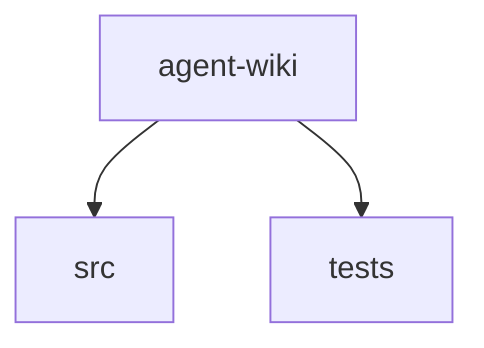

# agent-wiki Architecture Overview

> **Offline / inventory-derived architecture** (no LLM credentials configured). Review before relying on it.

## Summary

agent-wiki is a C#, Markdown, JSON codebase with 59 tracked files (~5,874 lines of text). Inventory discovery used `Git`. This document was produced offline from repository analysis (no LLM call).

## System context

Primary languages: C#, Markdown, JSON. Category mix — Source: 37, Tests: 11, Config: 7, Docs: 4.

## Diagram

## Layers

| Layer | Responsibility | Key paths |
|-------|----------------|-----------|
| src | Primary application and library source | `src/` |
| tests | Automated tests | `tests/` |

## Key components

- **CommandSettingsBase.cs** (`src/AgentWiki.Cli/Commands/CommandSettingsBase.cs`): Source file (C#)
- **GenerateCommand.cs** (`src/AgentWiki.Cli/Commands/GenerateCommand.cs`): Source file (C#)
- **InitCommand.cs** (`src/AgentWiki.Cli/Commands/InitCommand.cs`): Source file (C#)
- **StatusCommand.cs** (`src/AgentWiki.Cli/Commands/StatusCommand.cs`): Source file (C#)
- **UpdateCommand.cs** (`src/AgentWiki.Cli/Commands/UpdateCommand.cs`): Source file (C#)
- **TypeRegistrar.cs** (`src/AgentWiki.Cli/Infrastructure/TypeRegistrar.cs`): Source file (C#)
- **Program.cs** (`src/AgentWiki.Cli/Program.cs`): Source file (C#)
- **ArchitectureGenerator.cs** (`src/AgentWiki.Cli/Services/ArchitectureGenerator.cs`): Source file (C#)
- **ConfigLoader.cs** (`src/AgentWiki.Cli/Services/ConfigLoader.cs`): Source file (C#)
- **InitService.cs** (`src/AgentWiki.Cli/Services/InitService.cs`): Source file (C#)
- **MarkdownOutputWriter.cs** (`src/AgentWiki.Cli/Services/MarkdownOutputWriter.cs`): Source file (C#)
- **PlaceholderWikiGenerator.cs** (`src/AgentWiki.Cli/Services/PlaceholderWikiGenerator.cs`): Source file (C#)
- **PromptManager.cs** (`src/AgentWiki.Cli/Services/PromptManager.cs`): Source file (C#)
- **RepoAnalyzer.cs** (`src/AgentWiki.Cli/Services/RepoAnalyzer.cs`): Source file (C#)
- **SemanticKernelLlmCompletionService.cs** (`src/AgentWiki.Cli/Services/SemanticKernelLlmCompletionService.cs`): Source file (C#)

## Important flows

1. Developer/agent runs CLI or build tooling against repository source.
2. Configuration (csproj/json/yml) drives project composition and runtime settings.
3. Tests exercise source modules under tests/ or *.Tests projects.

## Key decisions

- Prefer inventory-backed paths over invented module names.
- Treat generated wiki output under docs/wiki as derived artifacts.

## Gotchas

- Offline mode cannot infer runtime topology or domain rules—verify against source.
- Ignored paths (bin/obj/node_modules/docs/wiki) are intentionally excluded from analysis.

## How to extend / modify

- Add source under existing top-level folders to match observed layout.
- Configure Azure OpenAI / OpenAI credentials to upgrade this page to LLM-authored architecture.
- Adjust IgnorePatterns and MaxFilesToAnalyze in .agentwiki/config.json to refine inventory.

---

_Repository: `agent-wiki`_
