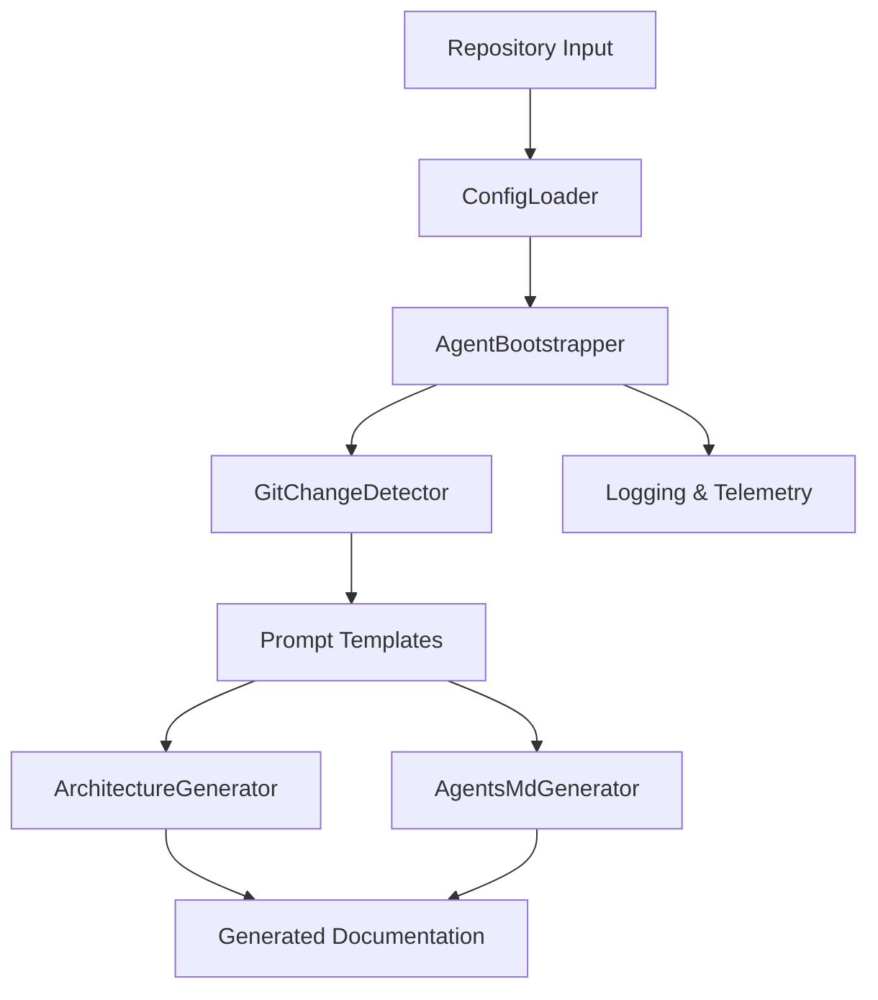

# AgentWiki Architecture Overview

> Architecture documentation for the **current** codebase (AI-assisted).

## Summary

AgentWiki is a .NET-based repository analysis and documentation generation system that produces AI-agent-friendly project documentation from source repositories. The solution combines repository inspection, configuration loading, git-aware change detection, prompt-driven AI generation, and optional desktop/UI components. The codebase is organized around application services in `src/AgentWiki.App`, with supporting projects, tests, examples, and CI automation.

## System context

The system analyzes a target repository, loads configuration and environment settings, determines repository state and changed files, assembles prompts from templates in `src/AgentWiki.App/Prompts/`, invokes AI-oriented generation workflows, and emits documentation artifacts such as architecture overviews and AGENTS.md content. Dependency injection is configured through application startup code, while CI workflows in `.github/workflows/` automate validation and wiki refresh processes.

## Diagram

## Layers

| Layer | Responsibility | Key paths |
|-------|----------------|-----------|
| Application Layer | Coordinates repository analysis, configuration, generation workflows, logging, telemetry, and orchestration. | `src/AgentWiki.App/` |
| Generation & Prompt Layer | Defines prompt templates and document generation services for architecture, modules, cross-link validation, and agent documentation. | `src/AgentWiki.App/Prompts/`, `src/AgentWiki.App/Services/` |
| Infrastructure Layer | Provides logging, telemetry, git integration, environment loading, and dependency registration. | `src/AgentWiki.App/Infrastructure/`, `src/AgentWiki.App/ServiceCollectionExtensions.cs`, `src/AgentWiki.App/Services/` |
| Configuration Layer | Loads application configuration, example settings, build properties, and environment variables. | `examples/agentwiki.config.json`, `Directory.Build.props`, `src/AgentWiki.App/Services/ConfigLoader.cs`, `src/AgentWiki.App/Services/DotEnvLoader.cs` |
| Automation & Delivery Layer | Runs CI validation, automated refresh workflows, packaging, installation, and example pipeline integrations. | `.github/workflows/`, `examples/github-actions/`, `examples/azure-pipelines/`, `scripts/` |
| Quality & Verification Layer | Contains automated tests validating application behavior and generation workflows. | `tests/` |

## Key components

- **AgentBootstrapper** (`src/AgentWiki.App/Services/AgentBootstrapper.cs`): Builds and coordinates AI-agent execution and generation workflows.
- **AgentsMdGenerator** (`src/AgentWiki.App/Services/AgentsMdGenerator.cs`): Generates AGENTS.md-style repository documentation.
- **ArchitectureGenerator** (`src/AgentWiki.App/Services/ArchitectureGenerator.cs`): Produces architecture-focused documentation from repository analysis.
- **ConfigLoader** (`src/AgentWiki.App/Services/ConfigLoader.cs`): Loads, validates, and resolves application configuration.
- **DotEnvLoader** (`src/AgentWiki.App/Services/DotEnvLoader.cs`): Imports environment variables from dotenv-style sources.
- **GitChangeDetector** (`src/AgentWiki.App/Services/GitChangeDetector.cs`): Determines repository changes and supports incremental analysis workflows.
- **GitProcess** (`src/AgentWiki.App/Services/GitProcess.cs`): Executes git operations used by repository analysis services.
- **AgentWikiLogging** (`src/AgentWiki.App/Infrastructure/AgentWikiLogging.cs`): Configures application logging behavior.
- **ApplicationInsightsRunTelemetry** (`src/AgentWiki.App/Infrastructure/ApplicationInsightsRunTelemetry.cs`): Captures execution telemetry and run-level observability.
- **ServiceCollectionExtensions** (`src/AgentWiki.App/ServiceCollectionExtensions.cs`): Registers application services and dependency injection wiring.
- **Prompt Templates** (`src/AgentWiki.App/Prompts/`): Stores reusable prompt definitions used by document generation services.

## Important flows

1. User or automation invokes the application or workflow.
2. Configuration is loaded through `src/AgentWiki.App/Services/ConfigLoader.cs` and environment settings are resolved through `src/AgentWiki.App/Services/DotEnvLoader.cs`.
3. Repository state is inspected using git services including `GitChangeDetector` and `GitProcess`.
4. Generation services load prompt templates from `src/AgentWiki.App/Prompts/` and construct AI-generation requests.
5. Generators such as `ArchitectureGenerator` and `AgentsMdGenerator` create repository documentation artifacts.
6. Logging and telemetry are emitted through infrastructure components.
7. CI workflows in `.github/workflows/` execute validation and refresh automation around generated content.

## Key decisions

- Uses dependency injection registration through `src/AgentWiki.App/ServiceCollectionExtensions.cs`.
- Separates generation orchestration from prompt content by storing prompts as files under `src/AgentWiki.App/Prompts/`.
- Encapsulates git access behind dedicated services instead of spreading git execution logic across generators.
- Keeps configuration loading centralized in `ConfigLoader` with environment support via `DotEnvLoader`.
- Includes telemetry and logging as explicit infrastructure concerns.
- Provides CI workflow automation and example integrations for GitHub Actions and Azure Pipelines.

## Gotchas

- Prompt behavior is defined by external text files in `src/AgentWiki.App/Prompts/`; update prompts and generator logic together when changing generation behavior.
- Git-aware functionality depends on services in `GitChangeDetector` and `GitProcess`; avoid bypassing them with ad hoc repository access.
- Configuration handling appears centralized in `ConfigLoader`; adding new settings should follow existing configuration-loading patterns.
- CI automation exists in `.github/workflows/`; changes to generated outputs may require corresponding workflow updates.
- Example pipeline files under `examples/github-actions/` and `examples/azure-pipelines/` are integration references and should remain consistent with application behavior.
- Logging and telemetry infrastructure are separate concerns; preserve observability when introducing new workflows.

## How to extend / modify

- Add new document-generation capabilities by creating prompt templates in `src/AgentWiki.App/Prompts/` and implementing a corresponding service in `src/AgentWiki.App/Services/`.
- Register new services through `src/AgentWiki.App/ServiceCollectionExtensions.cs` so they participate in dependency injection.
- Extend configuration through `src/AgentWiki.App/Services/ConfigLoader.cs` and update example configuration in `examples/agentwiki.config.json` when appropriate.
- Reuse existing git abstractions for repository inspection instead of introducing direct process calls in new components.
- Add automated validation in `tests/` for new generation workflows and configuration behavior.
- Update CI workflows in `.github/workflows/` if new generated artifacts or validation steps become required.

---

_Repository: `agent-wiki`_
