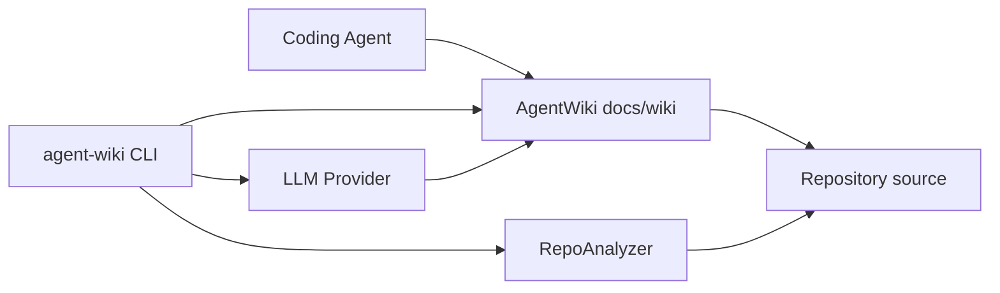

# Architecture Overview

> Structure inferred from inventory (Phase 2). Semantic architecture narrative arrives in Phase 3.

## System context

## Observed top-level layout

- `src/` — 30 files
- `tests/` — 7 files
- `(root)/` — 6 files

## Category mix

| Category | Files |
|----------|------:|
| SourceCode | 27 |
| Tests | 7 |
| Configuration | 7 |
| Documentation | 2 |
| Diagrams | 0 |
| Other | 0 |

## Implementation status

| Layer | Responsibility | Status |
|-------|----------------|--------|
| CLI | Spectre.Console commands | ✅ Phase 1 |
| Analysis | Repo inventory + gitignore | ✅ Phase 2 |
| Generation | Semantic Kernel multi-step pipeline | ⏳ Phase 3–4 |
| Incremental | Git-based selective updates | ⏳ Phase 5 |

## How to extend

- Phase 3 will replace this page with LLM-authored architecture content using the inventory summary.
- Customize ignore patterns in `.agentwiki/config.json` to refine what is analyzed.
