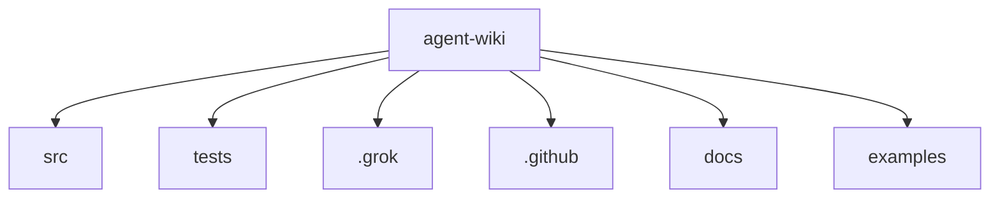

# agent-wiki Architecture Overview

> Architecture derived from the current repository inventory (no live LLM for this page).

## Summary

agent-wiki is a C#, Markdown, Shell, JSON, YAML codebase with 102 tracked files (~11,506 lines of text). Inventory discovery used `Git`. This document was produced offline from repository analysis (no LLM call).

## System context

Primary languages: C#, Markdown, Shell, JSON, YAML. Category mix — Source: 59, Tests: 21, Config: 9, Docs: 13.

## Diagram

## Layers

| Layer | Responsibility | Key paths |
|-------|----------------|-----------|
| src | Primary application and library source | `src/` |
| tests | Automated tests | `tests/` |
| .grok | Project area `.grok` | `.grok/` |
| .github | GitHub workflows and community files | `.github/` |
| docs | Human/agent documentation | `docs/` |
| examples | Sample code | `examples/` |
| scripts | Automation and tooling scripts | `scripts/` |

## Key components

- **bump-version.sh** (`.grok/skills/bump-version/scripts/bump-version.sh`): Source file (Shell)
- **pack-and-install-tool.sh** (`scripts/pack-and-install-tool.sh`): Source file (Shell)
- **CommandSettingsBase.cs** (`src/AgentWiki.Cli/Commands/CommandSettingsBase.cs`): Source file (C#)
- **GenerateCommand.cs** (`src/AgentWiki.Cli/Commands/GenerateCommand.cs`): Source file (C#)
- **InitCommand.cs** (`src/AgentWiki.Cli/Commands/InitCommand.cs`): Source file (C#)
- **StatusCommand.cs** (`src/AgentWiki.Cli/Commands/StatusCommand.cs`): Source file (C#)
- **TestProviderCommand.cs** (`src/AgentWiki.Cli/Commands/TestProviderCommand.cs`): Source file (C#)
- **UpdateCommand.cs** (`src/AgentWiki.Cli/Commands/UpdateCommand.cs`): Source file (C#)
- **AgentWikiLogging.cs** (`src/AgentWiki.Cli/Infrastructure/AgentWikiLogging.cs`): Source file (C#)
- **TypeRegistrar.cs** (`src/AgentWiki.Cli/Infrastructure/TypeRegistrar.cs`): Source file (C#)
- **Program.cs** (`src/AgentWiki.Cli/Program.cs`): Source file (C#)
- **AgentBootstrapper.cs** (`src/AgentWiki.Cli/Services/AgentBootstrapper.cs`): Source file (C#)
- **ArchitectureGenerator.cs** (`src/AgentWiki.Cli/Services/ArchitectureGenerator.cs`): Source file (C#)
- **ConfigLoader.cs** (`src/AgentWiki.Cli/Services/ConfigLoader.cs`): Source file (C#)
- **DotEnvLoader.cs** (`src/AgentWiki.Cli/Services/DotEnvLoader.cs`): Source file (C#)

## Important flows

1. Developer/agent runs CLI or build tooling against repository source.
2. Configuration (csproj/json/yml) drives project composition and runtime settings.
3. Tests exercise source modules under tests/ or *.Tests projects.

## Key decisions

- Prefer inventory-backed paths over invented module names.
- Treat generated wiki output under docs/wiki as derived artifacts.

## Gotchas

- Offline mode cannot infer runtime topology or domain rules—verify against source.
- Ignored paths (bin/obj/node_modules/docs/wiki) are intentionally excluded from analysis.

## How to extend / modify

- Add source under existing top-level folders to match observed layout.
- Configure Azure OpenAI / OpenAI credentials to upgrade this page to LLM-authored architecture.
- Adjust IgnorePatterns and MaxFilesToAnalyze in .agentwiki/config.json to refine inventory.

---

_Repository: `agent-wiki`_
